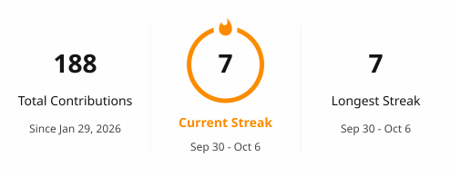

# Hi 👋, I'm Shruti Jumbad

### Computer Engineering Student | Java | DSA | Full-Stack Development

I'm a Computer Engineering student focused on Java programming, Data Structures & Algorithms, and Full-Stack Development. I enjoy building practical applications, solving programming problems, and continuously learning new technologies.

---

## 👩‍💻 About Me

- 🎓 Computer Engineering Student
- ☕ Focused on Java & Data Structures and Algorithms
- 🌐 Interested in Full-Stack Development
- 🚀 Building practical real-world applications
- 🤖 Exploring AI and modern technologies

---

## 📬 Contact Me

- 📧 Email: **[jumbadshruti97@gmail.com](mailto:jumbadshruti97@gmail.com)**
- 📄 Resume: **[View My Resume](https://drive.google.com/file/d/1VN16r6Q2rIsGAtJDuQ7l_5JxrvVQBDq7/view?usp=drivesdk)**

---

## 🚀 Featured Project

### ⭐ PlaceMate

Full-stack placement and job management platform connecting students, recruiters, and administrators.

**Tech:** React.js • Vite • Node.js • Express.js • MongoDB • JWT • REST APIs

🔗 [View Repository](https://github.com/1234shruti/placemate.git)

---

## 📂 Other Projects

### 🤝 SevaLink

AI-powered volunteer coordination platform for managing volunteers, tasks, and social-impact resources.

**Tech:** React.js • JavaScript • Gemini AI • AWS S3 • Map/Geolocation API

🔗 [View Repository](https://github.com/1234shruti/SevaLink.git)

---

### 🖐️ AirTouch

Touchless mouse control system using real-time hand gesture recognition to perform cursor movement, clicking, scrolling, drag-and-drop, and browser navigation.

**Tech:** Python • OpenCV • MediaPipe • NumPy • PyAutoGUI

🔗 [View Repository](https://github.com/1234shruti/AirTouch.git)

---

## 🧠 Data Structures & Algorithms

I practice Data Structures & Algorithms using Java to strengthen my problem-solving and coding skills.

🔗 [View DSA Repository](https://github.com/1234shruti/DSA.git)

---

## 🛠️ Languages & Tools

---

## 📊 GitHub Contributions & Streak

## 📊 GitHub Contributions & Streak

---

## 🔗 Connect With Me

---

⭐ Thanks for visiting my profile!
